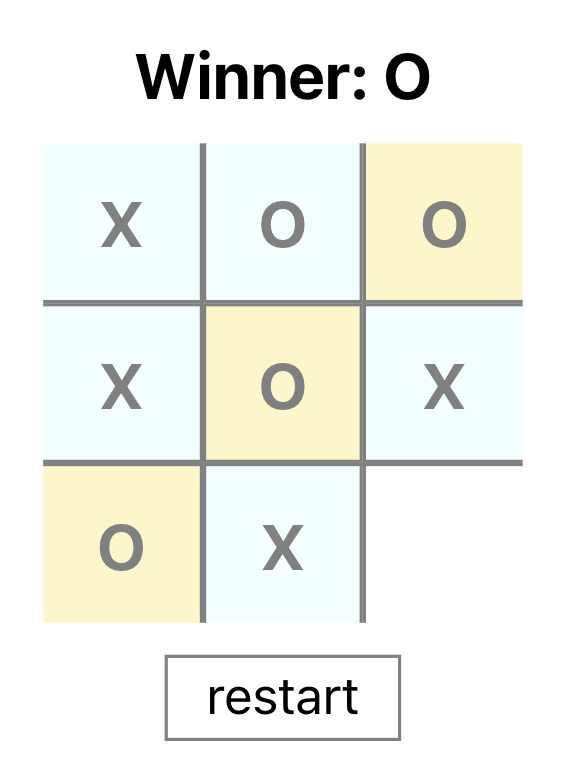

# Tic-Tac-Toe

Built a tic tac toe game which leverages a thought experiment around using regular Javascript classes to implement complex state in React applications. All of this with the intent of being able to create custom state managers without reference to framework specifics in React, Zustand, etc. See more details on how and why to use `useVanillaState` in [this repo](https://github.com/jaimefps/use-vanilla-state).

## Preview

